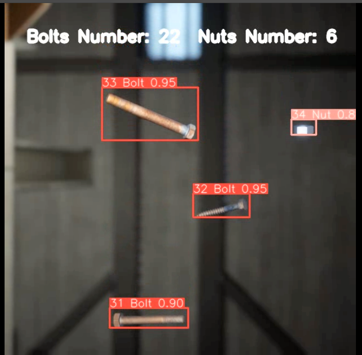

# Tracking Bolts and Nuts


<div align="center">
<p>

</p>

<br>
<div>
<a href="https://github.com/mikel-brostrom/Yolov5_DeepSort_Pytorch/actions"></a>
<br>  
<a href="https://colab.research.google.com/drive/18nIqkBr68TkK8dHdarxTco6svHUJGggY?usp=sharing"></a>

</div>

</div>


## Introduction

This repository contains a highly configurable two-stage-tracker that adjusts to different deployment scenarios. The detections generated by [YOLOv5](https://github.com/ultralytics/yolov5), a family of object detection architectures and models pretrained on the Bolts and Nuts dataset (7200 labelled pictures for train, 1800 labelled pictures for validation), are passed to a [Deep Sort algorithm](https://github.com/ZQPei/deep_sort_pytorch) which combines motion and appearance information based on [OSNet](https://github.com/KaiyangZhou/deep-person-reid) in order to tracks the objects. It can track any object that your Yolov5 model was trained to detect.


## Before you run the tracker

1. Clone the repository recursively:

`git clone https://github.com/ark60/Stroma-Case-Study.git`

2. Make sure that you fulfill all the requirements: Python 3.8 or later with all [requirements.txt] To install, run:

`pip install -r requirements.txt`


## Tracking sources

Tracking can be run on most video formats and different model structures.

Track with Pytorch Model.

```bash
$ python track.py --yolo_model best.pt --img 640 --device 0 --save-vid --source 0  # webcam
                                                                         img.jpg  # image
                                                                         vid.mp4  # video
                                                                         path/  # directory
                                                                         path/*.jpg  # glob
                                                                         'https://youtu.be/Zgi9g1ksQHc'  # YouTube
                                                                         'rtsp://example.com/media.mp4'  # RTSP, RTMP, HTTP stream
```
Track with ONNX model.

```bash
$ python track.py --yolo_model best.onnx --img 640 --device cpu --save-vid --dnn --source videos/test.mp4
                                     
```


## Select ReID model


### DeepSort

The above applies to DeepSort models as well. Choose a ReID model based on your needs from this ReID [model zoo](https://kaiyangzhou.github.io/deep-person-reid/MODEL_ZOO)

```bash


$ python track.py --yolo_model best.pt --img 640 --deep_sort_model osnet_x0_25_market1501
                                                                   osnet_x0_5_market1501
                                                                   osnet_x0_75_msmt17
                                                                   osnet_x1_0_msmt17
                                               ...
```

## Filter tracked classes

By default the tracker tracks all classes.

If you only want to track specific class

```bash
python3 track.py --source 0 --yolo_model best.pt --classes 0  # tracks bolts only
```

## MOT compliant results

Can be saved to your experiment folder `runs/track/<yolo_model>_<deep_sort_model>/` by 

```bash
python3 track.py --source ... --save-txt
```

